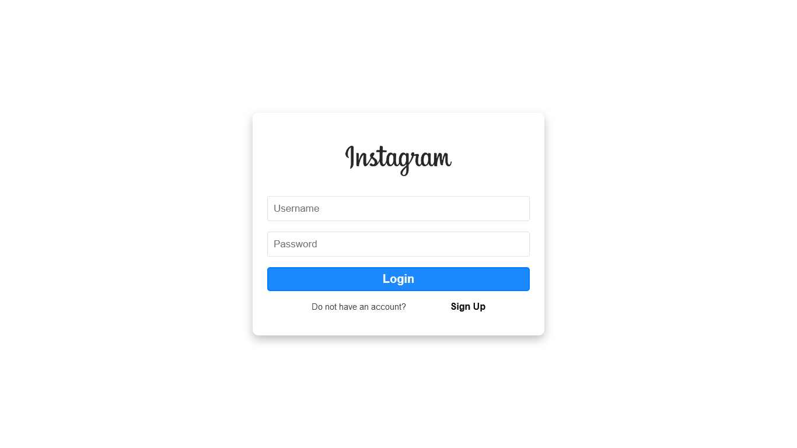
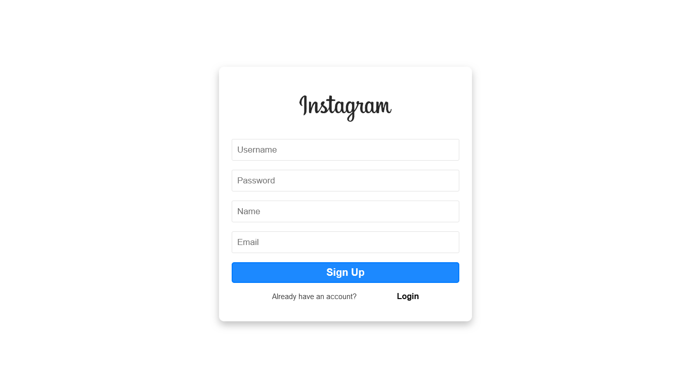

# Instagram User Page - React App 

## Description

This is a React application that mimics the user page of Instagram, allowing users to sign up or log in based on their choice. The project demonstrates the use of conditional rendering to switch between different views and provides a clean and intuitive user interface.

## Features

- Toggle between sign-up and login views.
- Basic input fields for username and password.
- Additional input fields for name and email when signing up.
- Responsive design for various screen sizes.

## Technologies Used

- React (with functional components and hooks)
- CSS (for styling the components)

## Screenshots

<!-- Add more screenshots if needed -->

  
Thanks