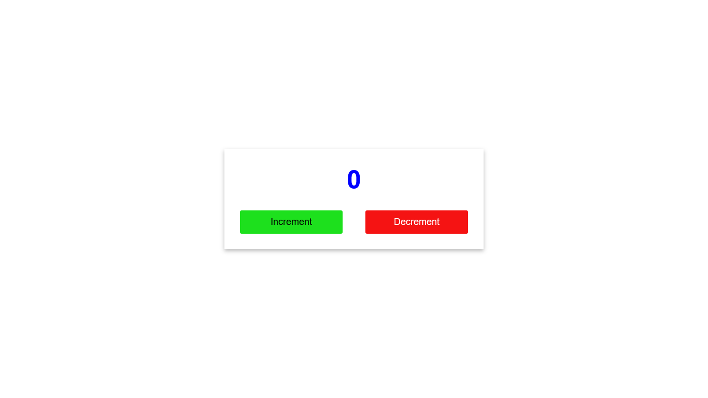

# React Counter App

A simple React application that demonstrates how to use the `useState` hook to implement a basic counter.
 

## Features

- Displays a counter with increment and decrement buttons.
- Uses the `useState` hook to manage the state of the counter.

## Technologies Used

- React (with functional components and hooks)

## Screenshot

 <!-- Add a screenshot of your app -->